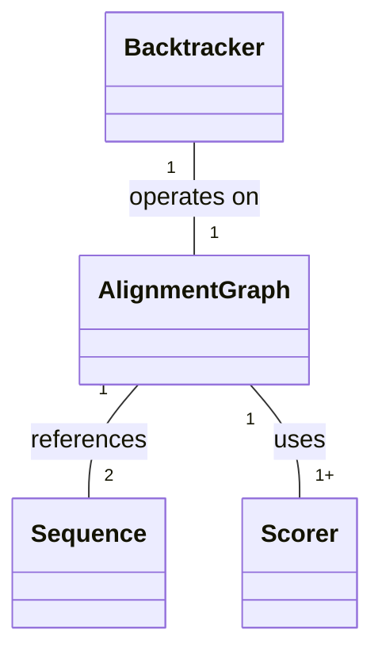

<p align="center"></p>

# Pairwise Alignment Primitives

The Pairwise Alignment Primitives project (PAlignPrims) is a C++ header-only library that provides the building blocks for assembling [pairwise](https://en.wiktionary.org/wiki/pairwise) [sequence aligners](https://en.wikipedia.org/wiki/Sequence_alignment). PAlignPrims generalizes alignment beyond bioinformatics, extending it to other domains while supporting broader bioinformatics use cases.

Why PAlignPrims?

 * **Composable**: Interfaces designed for composition, bundled with reusable adapters and implementations.
 * **Complete**: Sequences, scorers, graphs, and algorithms provided out of the box ([batteries included](https://en.wiktionary.org/wiki/batteries-included)).
 * **Configurable**: Tight control over algorithms, types, memory layout, and memory allocation.
 * **Safe**: Strong compile-time constraints with optional but equally strong runtime checks.
 * **Verified**: Tested and documented APIs, with tests doubling as usage examples.
 * **Modern**: Built using C++23, with stylistic / structural conventions from higher-level languages.

Choose a path:

* [I want to run an alignment](#running-alignments).
* [I want to build an aligner](#building-aligners).

> [!WARNING]
> C++ proficiency and familiarity with sequence alignment concepts are recommended.

## Table of Contents

* [Pairwise Alignment Primitives](#pairwise-alignment-primitives)
  * [Table of Contents](#table-of-contents)
  * [Running Alignments](#running-alignments)
    *  [Choosing a Preconfigured Aligner](#choosing-a-preconfigured-aligner)
    *  [Customizing Sequences and Scorers](#customizing-sequences-and-scorers)
    *  [Performance and Efficiency](#performance-and-efficiency)
  * [Building Aligners](#building-aligners)

## Running Alignments

The easiest way to use PAlignPrims is through one of its preconfigured aligners. The example below runs a global alignment on two character strings.

```c++
/////////////////////////////////////////////////////////////////
// Usage example: global alignment (dynamic programming, heap) //
/////////////////////////////////////////////////////////////////
#include <cstddef>
#include <cstdint>
#include <iostream>
#include <string>
#include "offbynull/aligner/aligners/global_dynamic_programming_heap_aligner.h"
#include "offbynull/aligner/scorers/simple_scorer.h"
#include "offbynull/aligner/aligners/utils.h"
#include "offbynull/aligner/aligners/concepts.h"

int main(void) {
    using offbynull::aligner::aligners::global_dynamic_programming_heap_aligner::global_dynamic_programming_heap_aligner;
    using offbynull::aligner::scorers::simple_scorer::simple_scorer;
    using offbynull::aligner::aligners::utils::alignment_to_stacked_string;

    constexpr bool debug_mode { true };  // Enable runtime checks

    // Create aligner.
    global_dynamic_programming_heap_aligner<debug_mode> aligner {};

    // Create scorers for substitutions and gaps: match=1 vs mismatch/gap=0.
    using SCORER = simple_scorer<
        debug_mode,
        std::size_t,  // Graph's node indexer type (keep this at std::size_t)
        char,         // Downward sequence's element type.
        char,         // Rightward sequence's elment type.
        int           // Score type.
    >;
    auto substitution_scorer { SCORER::create_substitution(1, 0) };
    auto gap_scorer { SCORER::create_gap(0) };

    // Align sequences.
    std::string down { "panama" };
    std::string right { "banana" };
    const auto& [alignment, score] {
        aligner.align(down, right, substitution_scorer, gap_scorer)
    };

    // Print out alignment with score.
    std::cout << alignment_to_stacked_string<debug_mode>(down, right, alignment) << std::endl;
    std::cout << score << std::endl;

    return 0;
}
```

PAlignPrims comes ready to use with several preconfigured aligners. To learn more about ...

 * preconfigured aligners, see [Choosing a Preconfigured Aligner](#choosing-a-preconfigured-aligner).
 * applying alignments to other domains, see [Customizing Sequences and Scorers](#customizing-sequences-and-scorers).
 * squeezing the best possible performance, see [Performance and Efficiency](#performance-and-efficiency).

### Choosing a Preconfigured Aligner

PAlignPrims comes ready to use with several preconfigured aligners, all of which live within [offbynull::aligner::aligners](https://github.com/offbynull/aligner/tree/main/offbynull/aligner/aligners). Each aligner is isolated to its own header file, where the name of the header file follows the pattern `{type}_{algorithm}_{allocation}.h`:

 * **{type}** is the type of alignment being performed: [global](https://offbynull.com/docs/data/learn/Bioinformatics/output/output.html#H_Global%20Alignment), [local](https://offbynull.com/docs/data/learn/Bioinformatics/output/output.html#H_Local%20Alignment), [overlap](https://offbynull.com/docs/data/learn/Bioinformatics/output/output.html#H_Overlap%20Alignment), [fitting](https://offbynull.com/docs/data/learn/Bioinformatics/output/output.html#H_Fitting%20Alignment), ...
 * **{algorithm}** is the algorithm performing the alignment: [dynamic programming](https://offbynull.com/docs/data/learn/Bioinformatics/output/output.html#H_Backtrack%20Algorithm) vs [sliced subdivision](https://offbynull.com/docs/data/learn/Bioinformatics/output/output.html#H_Divide-and-Conquer%20Algorithm).
 * **{allocation}** is the type of memory used to do the alignment: heap vs stack.

For example, [global_dynamic_programming_heap_aligner.h](https://github.com/offbynull/aligner/blob/main/offbynull/aligner/aligners/global_dynamic_programming_heap_aligner.h) performs global alignment using the dynamic programming algorithm with heap allocation.

> [!TIP]
>
> Which algorithm should you choose?
>
> * Choose dynamic programming to run alignments fast.
> * Choose sliced subdivision to run alignments slower but allow for much larger sequences.
>
> Which allocation strategy should you choose?
>
> * When aligning many tiny sequences, choose stack to avoid heap memory allocation overhead.
> * When aligning large sequences, choose heap to ensure enough memory is available.
> 
> Choose what's right for your use case. When in doubt, dynamic programming on the heap is a safe bet.

Regardless of which you choose, all preconfigured aligners have the same basic usage pattern: An align() function accepts a pair of sequences along with scorers and returns a maximally scored alignment path along with that path's score. The only difference is that ...

 * other aligners may require additional scorers (e.g., extended gap scoring).
 * subdivision aligners accept a score tolerance, which is important to mitigate rounding errors when the score type is floating point.

Each aligner’s test file includes an end-to-end usage example.

### Customizing Sequences and Scorers

The [parent section's introductory example](#running-alignments) focused on aligning two character strings, but chances are that you're looking at PAlignPrims because you need to do more than just align characters. PAlignPrims's [sequence interface](https://github.com/offbynull/aligner/blob/main/offbynull/aligner/sequence/sequence.h) is flexible enough to work with any element type (e.g., musical notes, sensor reading, waveform features, log events). As long as it's a finite sequence, PAlignPrims can represent it.

Likewise, PAlignPrims's [scorer interface](https://github.com/offbynull/aligner/blob/main/offbynull/aligner/scorer/scorer.h) is flexible enough to work with any element type and supports custom scoring logic, allowing implementations to capture nuance instead of being boxed into hardcoded substitution matrices. The elements being compared don't even have to be the same type (e.g., compare musical notes against sensor readings).

PAlignPrims comes bundled with common sequence and scorer implementations, living within [offbynull::aligner::sequences](https://github.com/offbynull/aligner/tree/main/offbynull/aligner/sequences) and [offbynull::aligner::scorers](https://github.com/offbynull/aligner/tree/main/offbynull/aligner/scorers) respectively. These bundled implementations are building blocks for constructing new and more accurate alignments. For example, if you have the [origin and terminus points](https://en.wikipedia.org/wiki/Circular_chromosome) of two bacterial genomes, you can pair each with its corresponding genome using [zip sequence](https://github.com/offbynull/aligner/blob/main/offbynull/aligner/sequences/zip_sequence.h) such that your pairwise alignment's scoring accounts for [GC skew](https://en.wikipedia.org/wiki/GC_skew).

<details><summary>Illustrative example: scoring zipped sequences</summary>

```c++
///////////////////////////////////////////////////////////////////////////////////
// Illustrative example (not biologically correct, not complete, not compilable) //
///////////////////////////////////////////////////////////////////////////////////

// Create two zip sequences. The zip augments genome by pairing each bases with its
// distance from ori.
auto seq1 { create_zip_sequence<debug_mode>(genome1, distance_to_ori1) };
auto seq2 { create_zip_sequence<debug_mode>(genome2, distance_to_ori2) };

// Create scorer to score elements from the zipped sequences.
struct gc_scorer {
    using WEIGHT = float;
    using SEQ_INDEX = std::size_t;

    WEIGHT operator()(auto&& down, auto&& right) const {
        if (!down || !right) {
            return -3.0f;  // Gap score
        }

        // Extract down element components.
        const auto& [down_idx, down_elem] { *down };
        const auto& [down_base, down_ori_dist] { down_elem };
        
        // Extract right element components.
        const auto& [right_idx, right_elem] { *right };
        const auto& [right_base, right_ori_dist] { right_elem };

        if (down_base == right_base) {
            return 1.0f;  // Match score
        }

        bool is_gc_pair {
            (down_base == 'G' && right_base == 'C') ||
            (down_base == 'C' && right_base == 'G')
        };
        if (is_gc_pair) {
            float ori_dist = std::min(down_ori_dist, right_ori_dist);
            return ori_dist;  // GC-aware score
        }

        return -1.0f;  // Mismatch score
    }
};
```

</details>

### Performance and Efficiency

The following techniques can improve PAlignPrims performance. Some are library-specific, while others are general best practices.

 * **Disable debug_mode.**

   Most PAlignPrims structs, classes, and free functions accept a debug_mode template parameter.

   * When debug_mode=true, runtime checks are enabled to ensure state and inputs are valid.
   * When debug_mode=false, runtime checks are disabled to increase performance.

   Enable debug_mode during development, and disable it when transitioning to production. 

 * **Enable OBN_PACK_STRUCTS.**

   PAlignPrims aligners automatically attempt to pick the narrowest types required to perform an alignment. Even then, memory usage may still be an issue. Heavily instantiated PAlignPrims structs and classes are often packable, enabling better memory utilization at the expense of unaligned memory access.

   If your platform supports unaligned memory access, struct packing can be enabled via the OBN_PACK_STRUCTS define.

 * **Choose the right memory allocation strategy.**

   PAlignPrims aligners support allocating memory either on the heap or the stack.

   * When performing many tiny alignments, choose the stack to avoid heap memory allocation overhead.
   * When performing larger alignments, choose the heap to ensure enough memory is available.

 * **Choose the right algorithm.**

   PAlignPrims aligners support different alignment algorithms.

   * Choose dynamic programming to run alignments fast.
   * Choose sliced subdivision to run alignments slower but allow for much larger sequences.

 * **Enable compiler optimizations.**

   When moving to production or doing real world testing, enable aggressive compiler optimizations such as -O3, link-time optimization, profile-guided optimization, and whatever other optimizations are available on your compiler / platform.

## Building Aligners

> [!TIP]
> This section focuses on defining new alignment graph types. Familiarity with [Running Alignments](#running-alignments) is recommended. If you only need to apply existing aligners to new domains, see that section instead.

PAlignPrims has four core components that act as building blocks to create new pairwise aligners.



 * **[Sequence](https://github.com/offbynull/aligner/blob/main/offbynull/aligner/sequence/sequence.h)**: Ordered list of elements, with a finite size and randomly accessible.
 * **[Scorer](https://github.com/offbynull/aligner/blob/main/offbynull/aligner/scorer/scorer.h)**: Function that computes the distance (score) between two sequence elements.
 * **[Alignment Graph](https://github.com/offbynull/aligner/blob/main/offbynull/aligner/graph/pairwise_alignment_graph.h)**: [DAG](https://en.wikipedia.org/wiki/Directed_acyclic_graph) enumerating all possible choices for a pairwise alignment.
 * **[Backtracker](https://github.com/offbynull/aligner/tree/main/offbynull/aligner/backtrackers)**: Function that computes a maximally scored path through an alignment graph.
 
As illustrated in the diagram above, these components are abstract, flexible, and composable. Components are expected to be swappable, allowing low-friction creation of new aligners and re-application of existing aligners to different domains.

The core component responsible for new pairwise alignment models is the alignment graph. An alignment graph encodes and enumerates the way two sequences can be aligned (e.g., local alignment vs global alignment). There are multiple [alignment graph interfaces](https://github.com/offbynull/aligner/blob/main/offbynull/aligner/graph), each intended to work with a specific [backtracker](https://github.com/offbynull/aligner/tree/main/offbynull/aligner/backtrackers): 

 * [graph](https://github.com/offbynull/aligner/blob/main/offbynull/aligner/graph/graph.h) → [graph backtracker](https://github.com/offbynull/aligner/tree/main/offbynull/aligner/backtrackers/graph_backtracker).
 * [pairwise alignment graph](https://github.com/offbynull/aligner/blob/main/offbynull/aligner/graph/pairwise_alignment_graph.h) → [pairwise alignment graph backtracker](https://github.com/offbynull/aligner/tree/main/offbynull/aligner/backtrackers/pairwise_alignment_graph_backtracker).
 * [sliceable pairwise alignment graph](https://github.com/offbynull/aligner/blob/main/offbynull/aligner/graph/sliceable_pairwise_alignment_graph.h) → [sliceable pairwise alignment graph backtracker](https://github.com/offbynull/aligner/tree/main/offbynull/aligner/backtrackers/sliceable_pairwise_alignment_graph_backtracker).
   
Each alignment graph interface builds on the one before it, either constraining it or extending it based on the requirements of the accompanying backtracking algorithm. For more information, see documentation embedded within source files and look through the unit tests for usage examples.
   
PAlignPrims comes bundled with several alignment graph adapters and implementations, including ...
 
 * [pairwise global alignment graph](https://github.com/offbynull/aligner/blob/main/offbynull/aligner/graphs/pairwise_global_alignment_graph.h).
 * [pairwise local alignment graph](https://github.com/offbynull/aligner/blob/main/offbynull/aligner/graphs/pairwise_local_alignment_graph.h).
 * [pairwise fitting alignment graph](https://github.com/offbynull/aligner/blob/main/offbynull/aligner/graphs/pairwise_fitting_alignment_graph.h).
 * [pairwise overlap alignment graph](https://github.com/offbynull/aligner/blob/main/offbynull/aligner/graphs/pairwise_overlap_alignment_graph.h).
 * [pairwise extended gap alignment graph](https://github.com/offbynull/aligner/blob/main/offbynull/aligner/graphs/pairwise_extended_gap_alignment_graph.h).
 *  [prefix sliceable pairwise alignment graph](https://github.com/offbynull/aligner/blob/main/offbynull/aligner/graphs/prefix_sliceable_pairwise_alignment_graph.h): Prefix view of a sliceable pairwise alignment graph (suffix truncated).
 *  [suffix sliceable pairwise alignment graph](https://github.com/offbynull/aligner/blob/main/offbynull/aligner/graphs/suffix_sliceable_pairwise_alignment_graph.h): Prefix view of a sliceable pairwise alignment graph (prefix truncated).
 *  [middle sliceable pairwise alignment graph](https://github.com/offbynull/aligner/blob/main/offbynull/aligner/graphs/middle_sliceable_pairwise_alignment_graph.h): Middle view of a sliceable pairwise alignment graph (prefix and suffix truncated).
 *  [reversed sliceable pairwise alignment graph](https://github.com/offbynull/aligner/blob/main/offbynull/aligner/graphs/reversed_sliceable_pairwise_alignment_graph.h): Reversed view of a sliceable pairwise alignment graph (root becomes leaf and vice versa).

Alignment graphs can either be built from scratch or by using an existing alignment graph as a base. For example, a fitting alignment graph can be used as a base for performing [rotational alignment](https://github.com/offbynull/aligner/blob/main/offbynull/aligner/aligners/rotational_dynamic_programming_heap_aligner.h).
